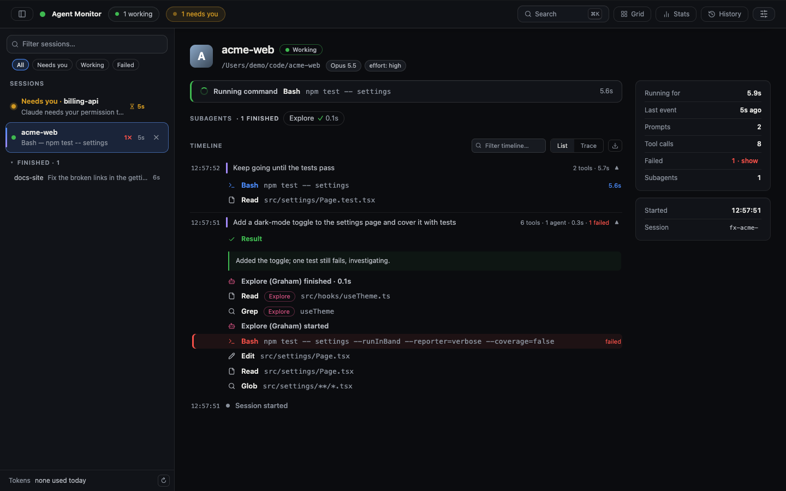
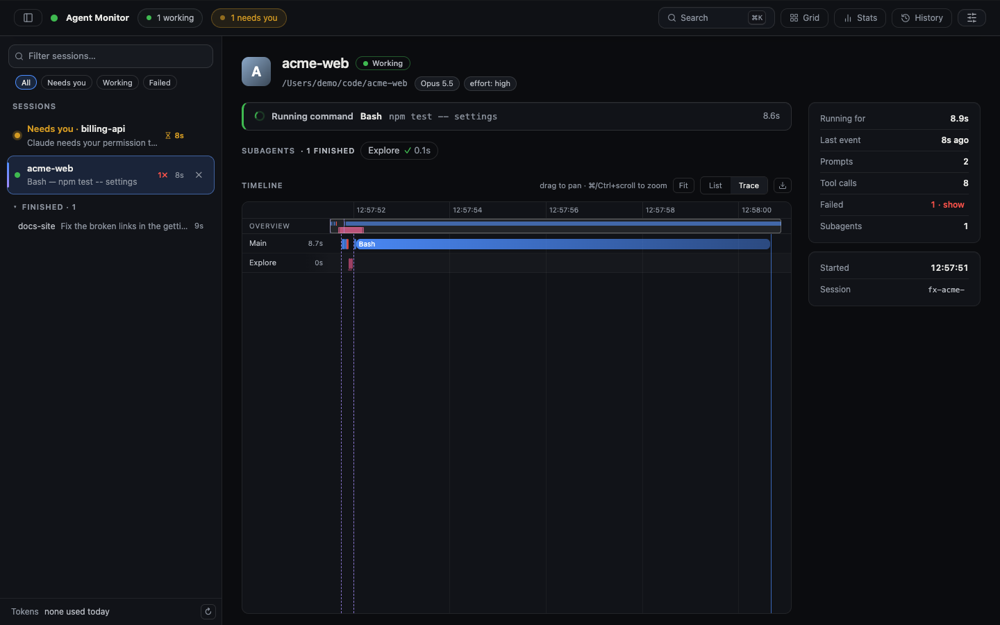
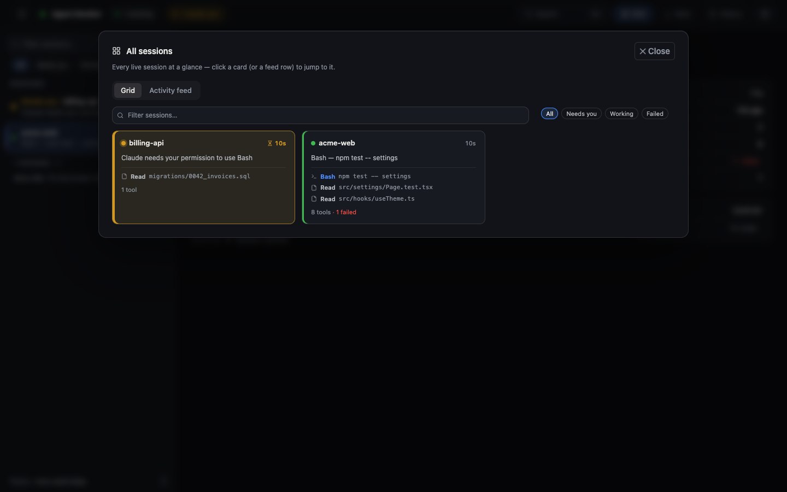
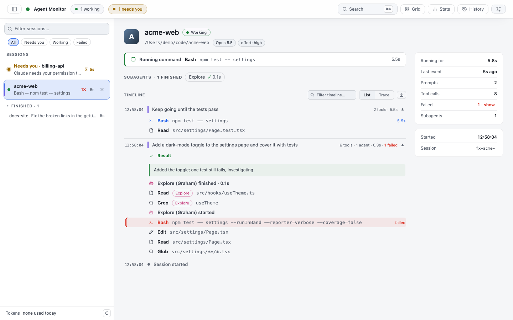

# claude-agent-monitor

A fully local, live dashboard for watching Claude Code sessions and their
subagents. Any other agent can feed it too — see [ADAPTERS.md](ADAPTERS.md).

The server binds to `127.0.0.1` only and the event log stays in this folder —
nothing ever leaves your machine.



| Trace waterfall | All sessions + needs-you | Light theme |
|---|---|---|
|  |  |  |

<sub>Screenshots use demo sessions from the e2e fixture, not real data.</sub>

## Setup

Requires [Bun](https://bun.sh). Cross-platform (macOS / Linux / Windows).

**1. Install & start the dashboard**

```sh
bun install       # first run only
bun run dev       # Vite UI (5173) + API/SSE server (3456) together, hot-reload
```

Then open **http://127.0.0.1:5173**. `bun run dev` proxies all API / SSE calls to
the backend on **3456**; both ports are bound to localhost only — nothing leaves
this Mac.

Stop it with `Ctrl-C` (or `lsof -ti :3456 :5173 | xargs kill`).

**2. Wire up the Claude Code hook** (required — without this the dashboard stays empty)

The dashboard is fed by a Claude Code hook that forwards every session event to
the local server. Make the forwarder executable, then register it for all
events in your **user-level** `~/.claude/settings.json` (applies to every
project):

```sh
chmod +x /ABSOLUTE/PATH/TO/claude-agent-monitor/hook-forward.sh
```

```jsonc
// ~/.claude/settings.json  — merge this into the existing "hooks" object
{
  "hooks": {
    "SessionStart":     [{ "hooks": [{ "type": "command", "command": "/ABSOLUTE/PATH/TO/claude-agent-monitor/hook-forward.sh" }] }],
    "SessionEnd":       [{ "hooks": [{ "type": "command", "command": "/ABSOLUTE/PATH/TO/claude-agent-monitor/hook-forward.sh" }] }],
    "UserPromptSubmit": [{ "hooks": [{ "type": "command", "command": "/ABSOLUTE/PATH/TO/claude-agent-monitor/hook-forward.sh" }] }],
    "Stop":             [{ "hooks": [{ "type": "command", "command": "/ABSOLUTE/PATH/TO/claude-agent-monitor/hook-forward.sh" }] }],
    "SubagentStop":     [{ "hooks": [{ "type": "command", "command": "/ABSOLUTE/PATH/TO/claude-agent-monitor/hook-forward.sh" }] }],
    "PreToolUse":       [{ "hooks": [{ "type": "command", "command": "/ABSOLUTE/PATH/TO/claude-agent-monitor/hook-forward.sh" }] }],
    "PostToolUse":      [{ "hooks": [{ "type": "command", "command": "/ABSOLUTE/PATH/TO/claude-agent-monitor/hook-forward.sh" }] }],
    "Notification":     [{ "hooks": [{ "type": "command", "command": "/ABSOLUTE/PATH/TO/claude-agent-monitor/hook-forward.sh" }] }]
  }
}
```

Replace `/ABSOLUTE/PATH/TO/claude-agent-monitor` with this folder's real path
(`pwd` prints it). The forwarder fails silently when the server is down, so it
never blocks or slows Claude Code. Start a new Claude Code session and events
will appear live.

## Architecture

```
Claude Code (any repo/directory)
  └─ hooks (~/.claude/settings.json — user-level, applies to ALL projects)
       └─ hook-forward.sh  → POST http://127.0.0.1:3456/event
            └─ server/server.ts   → events.db (SQLite) + SSE live broadcast (API only)
                 └─ Vite dev server (5173) serves the React app + proxies the API
                      └─ React app (Redux store ingests the SSE stream)
```

- **Backend** (`server/server.ts`): the same logic as the old `server.js`,
  ported to TypeScript. Collects hook events, broadcasts them over SSE, persists
  them to a local **SQLite** file (`events.db`, via built-in `bun:sqlite` — no
  server process, just a file in this folder), reads local token-usage from
  `~/.claude/projects/**/*.jsonl`, and replays past sessions with indexed
  queries. API only — the UI is served by Vite.
- **Frontend** (`src/`): React 19 with hooks. Redux Toolkit holds all state —
  `sessionsSlice` runs the event-ingestion reducer (Immer), `uiSlice` holds
  selection / view / filter, `usageSlice` holds token data. Styling is plain
  CSS on a small design-token system (`src/styles/tokens.css`: palette,
  semantic status colors, type / spacing / radius / elevation scales) — both
  themes are just token values, components never use raw colors or sizes.
  Toasts use `goey-toast`.

### Source map

```
index.html              app entry (pre-paint theme script)
src/
  main.tsx              React root + providers + CSS imports
  App.tsx               layout, hook wiring, overlays, inspector
  store/                Redux Toolkit: sessions / ui / usage slices + typed hooks
  lib/                  types, ingest (applyEvent port), format utils, legends, turns, markdown, api,
                        shortcuts (the one keyboard-shortcut registry), toolIcon
  hooks/                useEventStream, useTick, useUsage, useAlerts, useTheme, useNow,
                        useHotkeys, useUrlState
  components/           TopBar, Rail, Radio, TokenFooter, Detail, AgentLane,
                        Timeline, Trace, Inspector, Overlay, StatsOverlay, HistoryOverlay, Toast
  styles/               index.css (import order) · tokens.css (all colors & scales,
                        dark + light) · base.css (reset, app grid) · one file per
                        area: topbar, rail, detail, timeline, trace, inspector,
                        overlays, palette, empty, feedback · responsive.css (last)
tests/
  ingest.test.ts        unit tests for the event-ingestion reducer (incl. under Immer)
  e2e/smoke.e2e.ts      end-to-end smoke test: real backend + Vite + headless Chrome
server/
  server.ts             entry: http server
  config.ts · types.ts  constants + shared types
  routes.ts             method+path → controller
  helpers/              truncate, pricing, http utils
  models/               db (SQLite), eventStore, usageStore, historyStore (state + logic)
  validations/          request body limits + parsers
  controllers/          events, usage, history, focus handlers
```

## Features

Mission-control layout: a session list on the left, one always-live detail pane
on the right.

- **Session rail** — status dot (working / needs-you / idle), project name,
  one-line "what it's doing now", last-event age; filter box; ↑/↓ keyboard nav;
  finished sessions collapse into a `Finished` group. Sessions that need you
  float to the top with a live ⏳ wait-time badge, longest-waiting first. Once
  3+ sessions across 2+ projects are live, they group under a project header.
- **⌘K command palette** — jump to any session, switch views/filters/theme,
  open Stats/History, or full-text-search history, all from the keyboard
  (`⌘K` / `Ctrl+K`).
- **`?` keyboard shortcuts** — a cheatsheet of every shortcut, also reachable
  from Settings or the command palette. Handler and cheatsheet are generated
  from one registry (`src/lib/shortcuts.ts`), so they can't drift apart.
- **Deep links** — the session you pick and the List/Trace view live in the URL
  (`?s=<session id>&view=trace`): a reload keeps your place and a link opens
  the same session.
- **Full-text history search** — the History search box searches every recorded
  event (prompts, tool calls, results) via a local SQLite FTS5 index with
  highlighted snippets. The index lives inside `events.db`; nothing leaves your
  machine.
- **Needs-you queue** — the "N need you" pill in the top bar opens a triage
  queue sorted by longest-waiting; one click jumps to the session.
- **First-run checklist** — until the first event arrives, the dashboard shows
  a live 4-step setup wizard (server up → forwarder executable → hook
  registered → first event) with copy-paste commands using this folder's real
  path. Checks are local and read-only (`~/.claude/settings.json` is only
  inspected, never modified).
- **Detail pane** — built around "does anything need me?": the needs-you
  banner (with how long it has waited) is the loudest thing on screen, the live
  "now" line stays calm, and failed tool calls are tinted red. Subagents are
  named by type first (`Explore (Graham)` — the deterministic codename only
  disambiguates). The timeline groups rows into collapsible per-prompt turns
  with per-turn cost, a tool-family icon per row, timestamps shown only when
  they change, and a filter box; the **Trace** waterfall view (zoom / pan /
  minimap) fills the pane. On wide screens a summary column shows duration,
  tool calls, failures (click to filter), subagents, tokens and cost. Plus a
  tool-call inspector drawer with real diffs (the pane makes room for it) and
  Markdown export.
- **⏳ Needs you, system-wide** — tab title + favicon flip; enable **Alerts** for
  OS notifications and **Sound** for a chime when a session needs you or finishes
  a long task.
- **▦ Grid** (`G`) — every live session as a card in one glance (status,
  current activity, running subagents, failures), plus an **Activity feed**
  tab merging recent events across all of them in one chronological list.
  Click a card or a feed row to jump straight to that session.
- **📊 Stats** — two tabs: **Live now** (session/tool counts, failure rate,
  per-tool table for what this dashboard has seen) and **Your usage** (token
  usage from local transcripts: Overview / Models, All / 30d / 7d).
- **🕓 History** — browse & replay past sessions from the on-disk log.
- **Notes** (`N`, or Settings / ⌘K) — a project-wide scratchpad.
- **My token usage** (rail footer) — Today / 7d / 30d / Year from this machine's
  own local transcripts, priced at API list rates (an estimate, not your plan
  bill). Edit rates in `server/helpers/pricing.ts`. Can be hidden from
  Settings.
- **Vibe · Live** — inline lofi/radio player; off by default. Press `R` to
  reveal it and cycle stations, `P` to pause/resume the current one in place,
  `Shift+R` to stop & hide it entirely, or toggle it from Settings / the
  command palette.

## Testing

```sh
bun test          # unit tests for the ingestion reducer
bun run test:e2e  # smoke test in headless Chrome (~4 s)
bun run typecheck
```

The e2e smoke test starts its own backend and Vite dev server on free ports,
with a throwaway SQLite file (`AGENT_MONITOR_DB`) and an empty temp `HOME`, so
your real `events.db` and running dashboard are never touched. It drives the
locally installed Chrome over the DevTools Protocol — no extra dependencies, no
browser download — and skips itself if no Chrome/Chromium is found (point
`CHROME_PATH` at one). It covers: rail ordering, the needs-you pill and banner,
failed-row highlighting, a live tool finishing (no stuck "running"), the
inspector, URL deep links across a reload, the shortcuts cheatsheet and the
Stats tabs.

## Monitored events

SessionStart · SessionEnd · UserPromptSubmit · Stop · PreToolUse · PostToolUse ·
SubagentStop · Notification

## Notes

- Event history lives in `events.db` (a local SQLite file — plain-text prompts
  inside, do not share it). All history is kept (no rotation); any single string
  field is truncated at `MAX_FIELD_CHARS` (20000) before storing.
- Change the port with `PORT=4000 bun run server/server.ts` (update
  `hook-forward.sh` and the proxy targets in `vite.config.ts` too).

## Uninstall

1. Delete the `"hooks"` block from `~/.claude/settings.json`.
2. `lsof -ti :3456 | xargs kill` and delete this folder.
